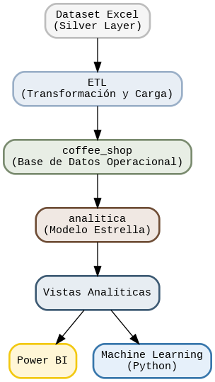

# ☕ Hudson Brew Analytics Project

Este proyecto ha sido desarrollado como parte de mi formación en un bootcamp de Data Analytics en Neoland, utilizando una franquicia ficticia de cafeterías llamada Hudson Brew.

El objetivo ha sido simular un caso real de negocio, construyendo una solución completa de analítica de datos desde cero: modelado de base de datos, análisis, visualización y aplicación de Machine Learning.

💡 Este es mi primer proyecto end-to-end en Data Analytics.  
A lo largo del desarrollo, he buscado no solo aplicar herramientas técnicas, sino también entender el negocio, plantear preguntas relevantes y traducir datos en decisiones.

🚀 Este es el nivel que he alcanzado en una etapa inicial de aprendizaje, mi objetivo es seguir evolucionando y aportar cada vez más valor en entornos reales.

---

## 🚀 Acceso rápido

- 📓 Notebook completo: `Proyecto_Integrador.ipynb`
- 📊 Dashboard Power BI: "https://app.powerbi.com/view?r=eyJrIjoiZDg0Y2QxOTUtOTNiNC00YWI0LWIxMGUtMDVkMDNlYWVlZDU4IiwidCI6ImFlYzc2MmU0LTNkNTQtNDk1ZS1hOGZlLTQyODdkY2U2ZmU2OSIsImMiOjh9&pageName=f41c4c681b682fdd5897"

---

## ⚙️ Arquitectura y Flujo de Trabajo

El proyecto ha sido desarrollado utilizando una arquitectura híbrida que combina SQL, Python y herramientas de visualización para construir un flujo de trabajo completo y reproducible.

### 🔹 Modelado y base de datos

- El diseño del modelo estrella (Star Schema) y la creación de tablas y vistas se realizaron en **PostgreSQL**.
- Incluye:
  - Tabla de hechos (`fact_sales`)
  - Dimensiones (`dim_store`, `dim_product`, `dim_date`)
  - Vistas analíticas para explotación

---

### 🔹 Integración con Python (Google Colab)

- La base de datos se conectó a **Google Colab** mediante **Ngrok**
- Esto permitió ejecutar análisis directamente desde Python sobre la base de datos

En Colab se desarrollaron:

- Análisis Exploratorio de Datos (EDA)
- Transformaciones
- Visualizaciones
- Modelos de Machine Learning

---

### 🔹 Notebook como núcleo del proyecto

El archivo `Proyecto_Integrador.ipynb` actúa como eje central del proyecto:

- Integra todo el flujo analítico completo
- Combina código, visualizaciones y explicaciones
- Permite ejecutar todo el análisis de forma secuencial

💡 El notebook no solo contiene el análisis, sino también la presentación estructurada del proyecto.

👉 Con su ejecución es posible:

- Reproducir todos los análisis realizados
- Entender el razonamiento paso a paso
- Acceder a las conclusiones finales

---

### 🔹 Visualización y Dashboard

- El dashboard fue desarrollado en **Power BI**
- Se incluye un enlace directo dentro del notebook para su visualización

👉 Esto permite explorar los resultados de forma interactiva sin salir del flujo de trabajo.

---

## 🧠 Enfoque del proyecto

El desarrollo sigue un flujo típico de un proyecto profesional:

1. Modelado de datos en SQL  
2. Explotación analítica en Python  
3. Visualización en Power BI  
4. Generación de insights de negocio  

---

## 🛠️ Tecnologías Utilizadas

- PostgreSQL  
- Python (Google Colab)  
- Power BI  
- Pandas, NumPy, Scikit-learn  
- Matplotlib, Seaborn  

---

## 📊 KPIs Definidos

- Ventas Totales
- Unidades Vendidas
- Número de Transacciones
- Ticket Medio (AOV)
- Precio Medio
- Crecimiento
- Categoría líder
- Producto estrella

---

## 📈 Principales Resultados

### 🔹 Crecimiento de ventas

- +103,8 % en 6 meses
- Tendencia claramente ascendente

---

### 🔹 Análisis por horario

- Hora punta: 07:00 – 10:00  
- Franja estable: 11:00 – 17:00  

---

### 🔹 Tiendas

- Hell's Kitchen → mejor rendimiento  
- Diferencias reducidas entre tiendas  

---

### 🔹 Categorías

- Coffee → líder absoluto  

---

### 🔹 Productos

- Hot Chocolate  
- Barista Espresso  

---

### 🔹 Machine Learning

- Regresión lineal → R² = 0.9383  
- Regresión logística → segmentación de ventas de alto valor  
- K-Means → patrones de consumo por hora

---

## 📌 Conclusiones

- Crecimiento sólido del negocio  
- Demanda concentrada en la mañana  
- Modelo consistente entre tiendas  
- Coffee domina ingresos  
- Viabilidad de expansión futura  

---

## 🚀 Recomendaciones

- Reforzar horario punta  
- Potenciar Coffee  
- Promocionar productos estrella  
- Replicar tienda top  
- Continuar con analítica avanzada  

---

## ⚠️ Limitaciones

- Datos limitados a 6 meses  
- No hay información de clientes  
- No hay costes de producto  

👉 Impacto:

- No se pueden analizar patrones estacionales completos  
- No es posible realizar segmentación de clientes  
- No se puede analizar rentabilidad (solo ingresos)  

---

## 🔮 Líneas futuras

- Incorporar datos de clientes (RFM, segmentación)  
- Añadir costes → análisis de márgenes  
- Ampliar histórico de datos  
- Implementar forecasting  
- Mejorar modelos predictivos  

---

## 🖼️ Arquitectura del proyecto

---

## 👤 Autor

**Elías Hernández Barral**  
RCC Service Engineer | Data Analytics  

---

## 📎 Nota

Proyecto académico que simula un entorno real de negocio con fines formativos.